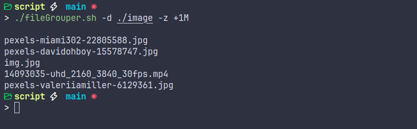

# FileGrouper

FileGrouper is a powerful Bash script for organizing and managing files within a directory. It provides various options to group, search, and filter files based on their type, size, or name.

## Features

- Group files by type, size, or name
- Display all files in a directory
- Search for files matching a specific pattern
- Get files of a specific size or type

## Usage

To use FileGrouper, follow these steps:

1. Make the script executable:

chmod +x fileGrouper.sh


2. Run the script with the desired options:
```bash
./fileGrouper.sh [options]

```

Available options:
- `-d <directory>`: Specify the directory to operate on (required)
- `-t`: Group files by type
- `-s`: Group files by size
- `-n`: Group files by name
- `-a`: Display all files in the directory
- `-f <pattern>`: Search for files matching the given pattern
- `-z <size>`: Get files of the specified size
- `-y <type>`: Get files of the specified type

Example usage:
```bash
./fileGrouper.sh -d /path/to/directory -t -s
```
This command will group files in `/path/to/directory` by both type and size.

## Examples

1. Group files by type:
```bash
./fileGrouper.sh -d /path/to/directory -t
```

2. Search for files with a `.txt` extension:
```bash
./fileGrouper.sh -d /path/to/directory -f "*.txt"
```

3. Get files larger than 10MB:
```bash
./fileGrouper.sh -d /path/to/directory -z +10M
```
4. Display all regular files in a directory:
```bash
./fileGrouper.sh -d /path/to/directory -y f
```

## Caution

Please be careful when using the grouping options (`-t`, `-s`, `-n`) as they will move files into new directories. It's recommended to test the script on a small sample directory first to ensure the desired behavior.

## Contributing

Contributions are welcome! If you find any issues or have suggestions for improvements, please open an issue or submit a pull request.

## License

This project is licensed under the [MIT License](LICENSE).

## Author

FileGrouper was created by reda ezziani . You can find more of my projects on [GitHub](https://github.com/redaezzaini).